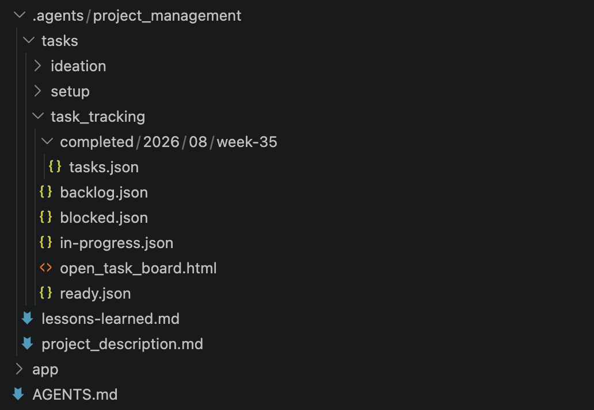

# Project Setup for Codex

> **TL;DR:** Set up a new or existing project with durable AI instructions, project docs, task tracking logic and local light-weight kanban/list view-only task page.

## What it do?

- Creates/Updates main `AGENTS.md`
    - Role
    - Development / Engineering rules (influenced by `$brooks-lint`)
    - Project structure map
    - Task tracking instructions
    - Projecto doc update instructions
    - MCP / Skill noting
    - Lessons Learned note taking rules
    - Project Description update rules
- Project Docs setup `.agents/project_management/`
- Task Tracking `.agents/project_management/tasks`.
- Creates Light-weight view-only task kanban/list html page for us --> the humans.
- Installs amazing skills
    - $brooks-lint
    - $caveman

## Included skills

| Skill | Purpose |
| --- | --- |
| `$brooks-lint` | Audits your codebase based on top 12 books on code quality, codebase debt, etc. |
| `$caveman`| Saves 70% of token usage by minimising words used for AI output (cuts out redundancy)|


# SETUP


### Full New Project Setup

- Copy/Paste in Codex session


**Full setup for new project**

```text
Run new project setup from https://github.com/xmasterg/project-setup.git
```


### Setup task tracking only

>Your current project structure and docs unchanged

```text
Add task tracking only to this project using https://github.com/xmasterg/project-setup.git. 
Install the track-project-tasks skill if missing. 
Preserve the current application and documentation layout.
```


### Task Tracking Page

- `.agents/project_management/tasks/task_tracking/open_task_board.html`.

**Kanban view**


**List View**


### Project Structure
