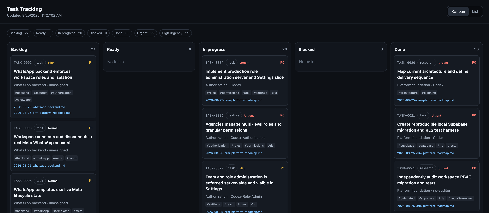
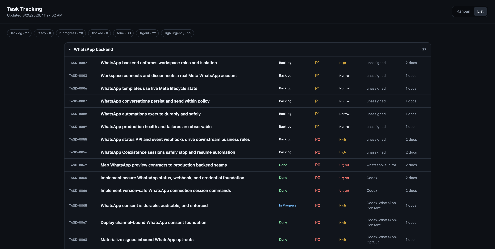

# skill-project-task-setup

> **TL;DR:** Shortcut to initialize new local project's folder setup with task tracking for AI and local kanban/list web page for humans.

You can choose the type of setup, e.g.:
- Run full new project setup (from folder structure to task tracking)
- Run partial setup, e.g. add task tracking to an existing project
- Update existing AGENTS.md file with specific section/-s
- ...

## What it do? (little bit more details)

- Creates/Updates (your choice) main `AGENTS.md`
    - Agent's **Role**
    - **Development / Engineering rules** (influenced by `$brooks-lint`)
    - **Project's file structure map**
    - **Task tracking** instructions
    - **Project documentation update** instructions
    - **Lessons Learned** note taking rules
    - **Project Description** update rules
- Sets up Project Docs in `.agents/project_management/`
- Sets up Task Tracking scripts and files in `.agents/project_management/tasks`.
- Creates from template Light-weight task kanban/list local only web page for the humans.
- Installs amazing skills (if missing)
    - $brooks-lint
    - $caveman

## **SUGGESTED SKILL**:

>Context7 (FREE) - "Up-to-date code documentation for LLMs and AI code editors"

>Consumes less tokens vs If Ai agent would search the web to find the latest documentation

- You need to manually install it [context7](https://context7.com/) 
- Context7 needs signup to get your personal API key. **No credit card needed!**
- [Context7 website url](https://context7.com)
- [Context7 Github repo url](https://github.com/upstash/context7)


# Using Project-Setup skill

- Starts with onboarding questions by AI to human
   - Setup type
   - The path to the local folder where to initialize the setup.
   - Git or No-Git
      - If Git --> local or remote
   
## Setup types:
- local folder only;
- local folder + local Git repository;
- local folder + remote Git repository; or
- an existing remote Git repository cloned locally.

## New project folder and file structure example

```text
project/
|-- .agents/project_management/
|   |-- project_description.md
|   |-- lessons-learned.md
|   `-- tasks/
|-- app/
|-- AGENTS.md
|-- README.md
`-- .gitignore
```

- `AGENTS.md` comes from the complete [`project-setup/assets/agents.template.md`](project-setup/assets/agents.template.md).
- `AGENTS.md` file includes:
   - project's file maps
   - documentation rules
   - task-tracking rules
   - engineering quality
   - security
   - maintainability
   -  testing guidance.

## This repo include these main skills

| Skill | Purpose |
| --- | --- |
| `project-setup/` | Creates the local project and applies the selected Git choice. |
| `task-tracking-setup/` | Installs, upgrades, migrates, repairs, or validates local task tracking. |


## Task tracking setup

>Sets up the folder and file structure and adds scripts for faster and less token consuming AI workflow when creating/editing/deleting/fetching tasks

- 

### **FYI**:
- `task-tracking-setup` - is only used for SETUP not daily dev work. 
- AI Agents follow instructions in `AGENTS.md` for 


## Task board web page (local file)

- Humans open task tracker in chrome or integrated IDE web viewer
   - File location inside project: `.agents/project_management/tasks/task_tracking/open_task_board.html` 
- Local file, no dev server needed




